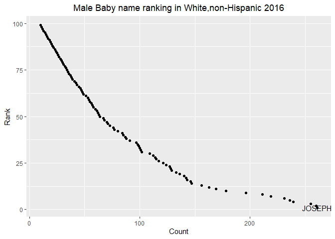

p8105\_hw2\_yq2251
================
TritonD
9/27/2019

``` r
library(tidyverse)
```

    ## -- Attaching packages ----------------------------------------- tidyverse 1.2.1 --

    ## v ggplot2 3.2.1     v purrr   0.3.2
    ## v tibble  2.1.3     v dplyr   0.8.3
    ## v tidyr   1.0.0     v stringr 1.4.0
    ## v readr   1.3.1     v forcats 0.4.0

    ## -- Conflicts -------------------------------------------- tidyverse_conflicts() --
    ## x dplyr::filter() masks stats::filter()
    ## x dplyr::lag()    masks stats::lag()

``` r
library(readxl)
library(dplyr)
```

## Question 1

## import data sheet Mr. Trash Wheel

``` r
MrTrashWheel_data = read_excel( "./Trash-Wheel-Collection-Totals-8-6-19.xlsx", sheet= "Mr. Trash Wheel", range = cell_cols("A:N"))%>%
 janitor::clean_names()%>%
drop_na(dumpster)%>%
  mutate(sports_balls=as.integer(round(sports_balls)))
```

## import datasheet Rain\_2017 and Rain\_2018

``` r
Rain_2017 = read_excel( "./Trash-Wheel-Collection-Totals-8-6-19.xlsx", sheet= "2017 Precipitation", range = "A2:B14")%>%
janitor::clean_names()%>%
  drop_na(total)%>%
  mutate(year=2017)
```

``` r
Rain_2018 = read_excel( "./Trash-Wheel-Collection-Totals-8-6-19.xlsx", sheet= "2018 Precipitation",range = "A2:B14")%>%
janitor::clean_names()%>%
  drop_na(total)%>%
  mutate(year=2018)
```

## Using full\_join to combine 2017-18 data and rename “month”

``` r
Rain_Total=
full_join(Rain_2017,Rain_2018, by=NULL)%>%
mutate(month=month.name[month])
```

    ## Joining, by = c("month", "total", "year")

In dataset “MrTrashWheel\_data”, there are 14 columns with 344
observations. Key variables including “weight\_tons” which shows the
amount of garbage they were collected each day, “dumpster” represents
the number of dumpsters collected. In dataset “Rain\_Total”, there are 3
columns with 19 observations.Key variables including “total” which
represents the amount of precipitation in that month. Total
precipitation in 2018 is 23.50 inches, the median number of sports balls
in a dumpster in 2017 is
8.

## Question 2

## use separate function to separate “mon” and create variable “president”

``` r
Pols = read_csv( "./pols-month.csv")%>%
  separate(mon, into = c("year", "month","day"), sep = "-")%>%
  mutate(month=as.integer(month),year=as.integer(year),day=as.integer(day))%>%
  mutate(month=month.name[month])%>%
  mutate(president= ifelse(prez_gop %in% 0, "dem",
        ifelse(prez_gop %in%1, "gop","gop")))%>%
  select(-prez_dem,-prez_gop,-day)
```

    ## Parsed with column specification:
    ## cols(
    ##   mon = col_date(format = ""),
    ##   prez_gop = col_double(),
    ##   gov_gop = col_double(),
    ##   sen_gop = col_double(),
    ##   rep_gop = col_double(),
    ##   prez_dem = col_double(),
    ##   gov_dem = col_double(),
    ##   sen_dem = col_double(),
    ##   rep_dem = col_double()
    ## )

``` r
snp=read_csv( "./snp.csv")%>%
  separate(date, into = c("day", "month","year"), sep = "/")%>%
  mutate(month=as.integer(month),year=as.integer(year),day=as.integer(day))%>%
  mutate(month=month.name[month])%>%
  select("year", everything())%>% 
  select(-day)
```

    ## Parsed with column specification:
    ## cols(
    ##   date = col_character(),
    ##   close = col_double()
    ## )

## use dataset unemployment,change abbreviated month name to full

``` r
unemploy=read_csv( "./unemployment.csv")%>%
  rename(January=Jan, February=Feb, March=Mar, April=Apr,June=Jun,July=Jul,August=Aug,September=Sep,October=Oct,November=Nov, December=Dec)
```

    ## Parsed with column specification:
    ## cols(
    ##   Year = col_double(),
    ##   Jan = col_double(),
    ##   Feb = col_double(),
    ##   Mar = col_double(),
    ##   Apr = col_double(),
    ##   May = col_double(),
    ##   Jun = col_double(),
    ##   Jul = col_double(),
    ##   Aug = col_double(),
    ##   Sep = col_double(),
    ##   Oct = col_double(),
    ##   Nov = col_double(),
    ##   Dec = col_double()
    ## )

``` r
unemploy_tidy=
  pivot_longer(
    unemploy, 
    January:December,
    names_to = "month", 
    values_to = "unemployment_rate")
```

## join the datasets

``` r
snp_pols=left_join(Pols,snp,by=NULL)
```

    ## Joining, by = c("year", "month")

``` r
snp_pols_unemploy=left_join(snp_pols,unemploy_tidy, by=NULL)
```

    ## Joining, by = "month"

Dataset “snp” contains 787 observations in 3 columns presenting Standard
& Poor’s stock market index (S\&P) from March 1950-Jan 2015.

Dataset “Pols” has 822 observations of 9 variables presenting \# of
national politicians who are democratic or republican ranging from
Jan1947-June 2015.

Dataset “unemploy\_tidy” has 816 observations of 3 columns presenting
the unemployment rate from Jan 1948-June 2015.Important variable include
“president” and “close”.

Dataset “snp\_pols”has 1391 observations in 10 columns, which is a
combination of dataset “snp” and “Pols”.Important variable include
“president”, “close” and "unemployment\_rate.

Dataset “snp\_pols\_unemploy” has 94,588 observations with 12 columns,
which is a combination of dataset “snp\_pols” and “unemploy\_tidy”.

## Question 3

# read “Names” dataset and rename categorical names

``` r
Names= read_csv( "./Popular_Baby_Names.csv")
```

    ## Parsed with column specification:
    ## cols(
    ##   `Year of Birth` = col_double(),
    ##   Gender = col_character(),
    ##   Ethnicity = col_character(),
    ##   `Child's First Name` = col_character(),
    ##   Count = col_double(),
    ##   Rank = col_double()
    ## )

``` r
Names$Ethnicity[Names$Ethnicity == "ASIAN AND PACI"]<-"ASIAN AND PACIFIC ISLANDER"
Names$Ethnicity[Names$Ethnicity == "BLACK NON HISP"]<-"BLACK NON HISPANIC"
Names$Ethnicity[Names$Ethnicity == "WHITE NON HISP"]<-"WHITE NON HISPANIC"
```

## change cases of names into all upper case

``` r
Names$`Child's First Name`=toupper(Names$`Child's First Name`)
```

## remove duplicated rows

``` r
dplyr::distinct(Names,Ethnicity,Gender,`Child's First Name`,.keep_all= TRUE)
```

    ## # A tibble: 2,986 x 6
    ##    `Year of Birth` Gender Ethnicity          `Child's First Na~ Count  Rank
    ##              <dbl> <chr>  <chr>              <chr>              <dbl> <dbl>
    ##  1            2016 FEMALE ASIAN AND PACIFIC~ OLIVIA               172     1
    ##  2            2016 FEMALE ASIAN AND PACIFIC~ CHLOE                112     2
    ##  3            2016 FEMALE ASIAN AND PACIFIC~ SOPHIA               104     3
    ##  4            2016 FEMALE ASIAN AND PACIFIC~ EMILY                 99     4
    ##  5            2016 FEMALE ASIAN AND PACIFIC~ EMMA                  99     4
    ##  6            2016 FEMALE ASIAN AND PACIFIC~ MIA                   79     5
    ##  7            2016 FEMALE ASIAN AND PACIFIC~ CHARLOTTE             59     6
    ##  8            2016 FEMALE ASIAN AND PACIFIC~ SARAH                 57     7
    ##  9            2016 FEMALE ASIAN AND PACIFIC~ ISABELLA              56     8
    ## 10            2016 FEMALE ASIAN AND PACIFIC~ HANNAH                56     8
    ## # ... with 2,976 more rows

## table showing the rank in popularity of the name “Olivia” as a female baby name over time

``` r
olivia_female=filter(Names,Gender=="FEMALE", `Child's First Name`=="OLIVIA")%>%
select(-Count)
```

## showing the most popular name among male children over time

``` r
male=filter(Names, Gender=="MALE", Rank == 1 )%>%
  select(-Count)
```

## remove any duplicated rows

``` r
Names <- droplevels(Names)
Names <- unique(Names)

ONames <- Names [ which(Names$Gender=="FEMALE" & Names$`Child's First Name`== "OLIVIA"),]
OMatrix <- xtabs(Rank ~ Ethnicity + `Year of Birth`, data = ONames)
OMatrix
```

    ##                             Year of Birth
    ## Ethnicity                    2011 2012 2013 2014 2015 2016
    ##   ASIAN AND PACIFIC ISLANDER    4    3    3    1    1    1
    ##   BLACK NON HISPANIC           10    8    6    8    4    8
    ##   HISPANIC                     18   22   22   16   16   13
    ##   WHITE NON HISPANIC            2    4    1    1    1    1

## scatter plot

``` r
library(ggplot2)
WMNH2016N <- Names [ which(Names$Gender=="MALE"& Names$Ethnicity=="WHITE NON HISPANIC" & Names$`Year of Birth`=="2016"), ]
WMNH_PLOT <-ggplot(WMNH2016N,aes(x=Count,y=Rank, label = `Child's First Name`))
WMNH_PLOT + geom_point() + geom_text(data=subset(WMNH2016N, Rank<2))+ggtitle("Male Baby name ranking in White,non-Hispanic 2016")+theme(plot.title = element_text(hjust = 0.5))
```

<!-- -->
This is the scatter plot showing the number of children with a name
against the rank in popularity of that name for male, white non-hispanic
children born in 2016.With the name on the right bottom side the first
rank name “Joseph” that largest amount of children are named with. As
the children count decreases, the rank of the name increases(less
popular).
